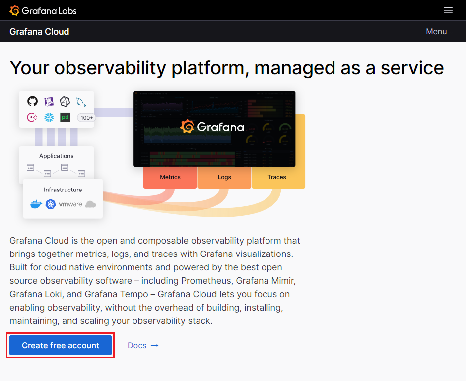
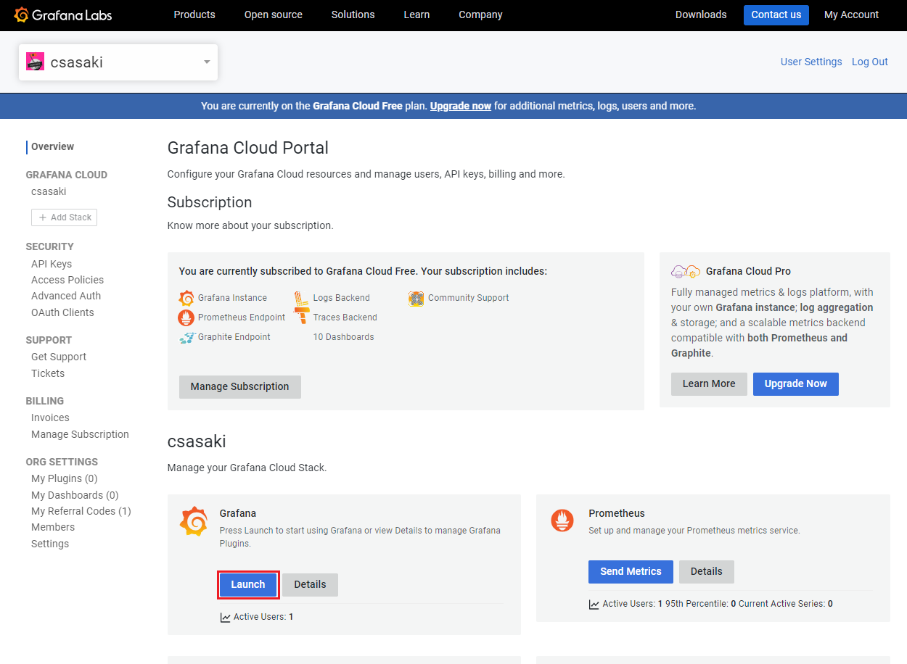
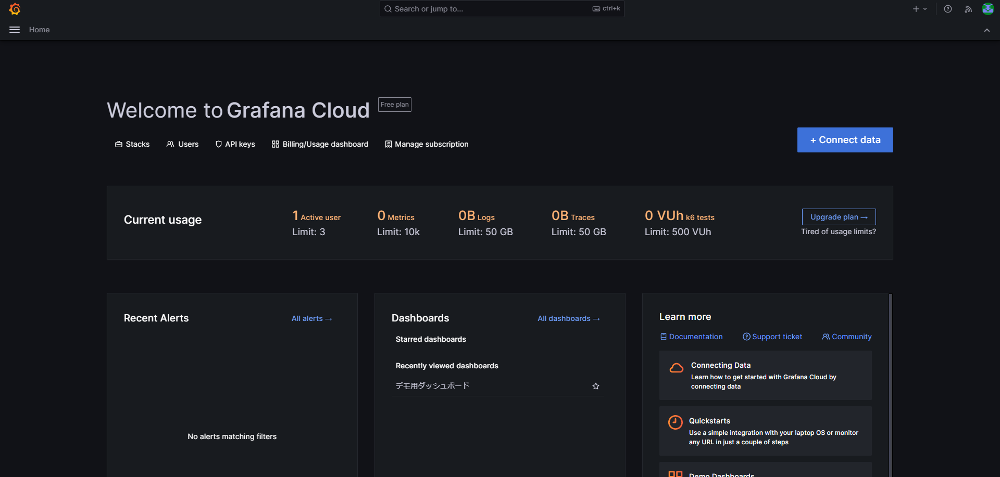
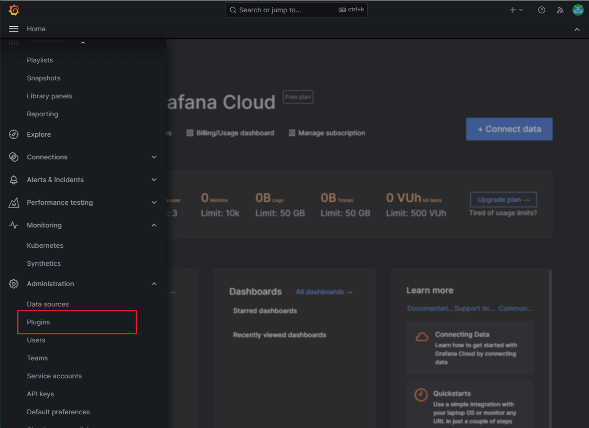
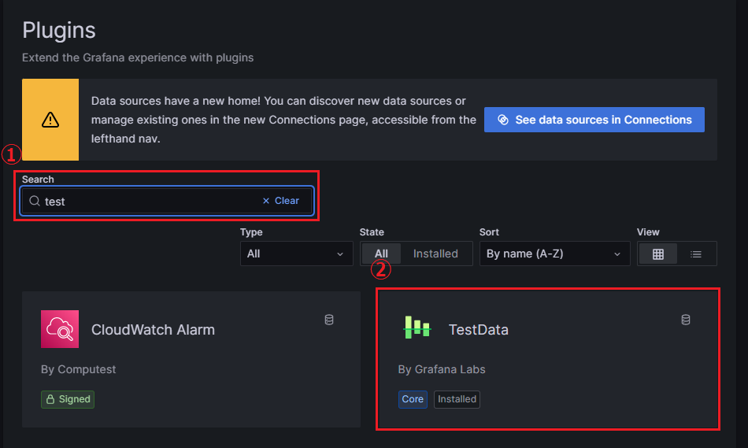
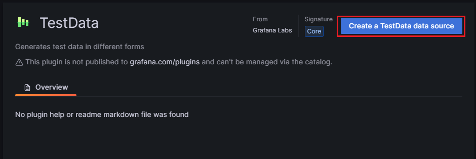
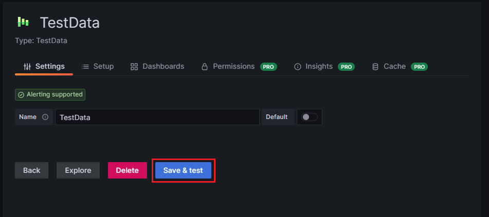

# Grafana はじめてのDashboard作成

## デモダッシュボードの作成

### 事前準備

1. Grafana Cloudのアカウントを作成する
    - Grafana Cloudのサイトで [Create free account] を押下してGrafana Cloudアカウントを作成する
        
    
        
2. Grafanaインスタンスを作成する
    - ログインしたGrafana Cloudのページから、Grafanaの[launch]ボタンを押下してGrafanaインスタンスを作成する。
    
    
    
    - インスタンスが立ち上がると、GrafanaのHomeが表示される。
    
    
    
3. 「TestData」プラグインを追加
    - 左上のハンバーガーアイコンをクリックしてメニューを表示させ、[Administration] → [Plugins] を選択してプラグイン管理画面へ移動
    
    
    
    - plugin検索フォームにtestと入力し、TestDataプラグインを選択
    
    
    
    - [Create a TestData data source]をクリック
    
    
    
    - データソース選択画面で「TestData」というデータソース名が自動で入力されているので、そのまま[Save & test]を押下してデータソースを登録する。
    
    
    
    - 登録が正常に完了すると、「Data source is working」と表示される。
4. デモ用のダッシュボードの読み込み
    - データソースの登録完了後、Grafanaの左メニューから[Dashboards]のタブを選択、更に[New] → [Import] → [Update JSON file] で「[売上情報.json](assets/%E5%A3%B2%E4%B8%8A%E6%83%85%E5%A0%B1.json)」を選択し、売上情報のTableのパネルが作成されているダッシュボードを読み込む。ここでTestData DBには”TestData”を選択する。
    - するとダッシュボードが読み込まれ、以下の画面が表示される。これで事前準備が完了。
    
    
    

### 作成するパネル

今回のデモでは、事前準備で読み込んだ食品販売業者の売上情報を用いて、ダッシュボード上で3種類のパネルを追加する編集をしていきます。このデモを通して、Grafanaの可視化の操作について学んでいきましょう。

- 作成するパネル
    1. 日付ごとの売上金額（棒グラフ）
        
    
        
    2. 商品別売上金額ランキング（棒グラフ）
        
    
        
    3. 商品別売上金額割合（円グラフ）
        
    
        

### パネルの編集

- 日付ごとの売上金額グラフの作成
    - まず、Table形式で表示されているパネルの右上のアイコンをクリック → 表示されたメニューの [More] → [Duplicate] でパネルを複製する
    - 新しく作成したパネル右上をクリックしてメニューを表示し、[Edit] を選択して編集画面に遷移
    - 右側上部の[Visualizations]メニューから[Bar chart]を選択する。
    - [Panel options] の Titleを「日付ごとの売上金額」に変換する
    - するとまず、行ごとですべての値を棒グラフにプロットしたグラフが表示される
        - 表示されるグラフは、編集画面上部のTable viewをONにした際のtableの情報をもとに描画されている
    - ここから、日付でグループ化して売り上げの合計を表示するように、[Transform]でデータを整形する
        - [Add transformation] → [Group by]で、SQLと同じようにGroup byの操作ができる。日付ごとにグループ化した売上金額の合計値を利用したいので、”日付”でGroup byして、売上金額のTotalを求める。
        - 設定後のTable viewとTransformの設定は以下の通り。
        
        
        
        - データの整形が完了したので、Table viewをOFFにして、棒グラフを表示させる。すると、日付ごとの売上情報が表示されている。
        - 完成系はこちら。
        
        
        
- 商品別売上ランキング棒グラフの作成
    - 先ほどの新しいグラフを作成したときと同様に、Table形式で表示されているパネルの右上をクリック → 表示されたメニューの [More] → [Duplicate] でパネルを複製する
    - 新しく作成したパネル右上をクリックしてメニューを表示し、[Edit] を選択して編集画面に遷移
    - 右側上部の[Visualizations]メニューから[Bar chart]を選択する。
    - [Panel options] の Titleを「商品ごとの売上金額ランキング」に変換する
    - するとまず、行ごとですべての値を棒グラフにプロットしたグラフが表示される
    - ここから、商品名でグループ化して売り上げの合計を表示するように、[Transform]でデータを整形する
        - 編集画面下部の[Query]タブの横にある[Transform]を利用すると、データソースから読み込んだ値に対して様々な変形を加えることができる
        - 整形するデータの形式を確認するために、画面上部の[Table view] をONにする
        - [Add transformation] → [Group by]で、今回は商品ごとでGroup byし、売上金額の合計を求める。
        - [Add transformation] → [Sort by] で売上金額を降順でソートする。
        - 設定後のTable viewとTransformの設定は以下の通り。
        
        
        
        - 
        - データの整形が完了したので、Table viewをOFFにして、棒グラフを表示させる。すると、商品ごとの売上情報が表示されている。
        - 右側のオプションの[Bar chart]セクションから、OrientationでHorizontalを選択して、表示を横棒グラフに変更する。
    - 完成系はこちら
    
    
    
- 商品別売上金額割合の円グラフの作成
    - まず、Table形式で表示されているパネルの”売上情報”のパネルの右上のメニューから [More] → [Duplicate] でパネルを複製し、編集画面へ移動
    - [Panel options]内でTitleを「商品別売上金額割合」に変更する
    - 右側上部の[Bar chart]をクリックし、タブから[Suggestions]を選択する。すると、おすすめのグラフ形式が表示されるので、その中から円グラフを選択する。
    - すると、商品ごとの売上の割合を示した円グラフが生成される。
    - 完成系はこちら
    
    
    
- パネルの改善
    - Overrideを使って単位をつける
        - Overrideという機能を使うと、フィールド名（カラム名）を指定して設定項目を上書きすることができる。
        - この機能を使うと、単位を付けることが可能
        - 新たに作成した売上のsumのカラムに関して、overrideで単位を追加
        
        
        
    - ダッシュボード内のパネルを並べ替えて、見やすくする。
    - 最終系はこちら
        
    
        
## おまけ
### その他のデータソース
他にも一般的によく用いられるデータソースとして、以下のようなものが挙げられます。今回は、時系列データに着目せずにダッシュボードの編集方法を中心にデモを行いましたが、Grafanaは時系列データを処理することも得意としているため、インフラ監視、アプリ監視など、時系列データに対するリアルタイム監視ツールとして多く用いられています。
- Prometheus: オープンソースのシステムおよびサービスのモニタリングおよびアラートングシステムであり、Grafanaでデータをクエリしてグラフやダッシュボードを作成し、リアルタイムのモニタリングを行うことができます。
- InfluxDB: オープンソースの高速時系列データベースであり、Grafanaで時系列データを表示し、リアルタイムのモニタリングを行うことができます。
- Elasticsearch: オープンソースの分散型検索および分析エンジンであり、ログデータやデータの検索、集約、可視化をGrafanaで行うことができます。
- MySQL: オープンソースのリレーショナルデータベース管理システムであり、GrafanaでMySQLデータベースのデータを可視化することができます。
また、プラグインは自分で作成可能であるため、技術力次第ではどんなデータソースにも対応させることができ、さらにOSSのコミュニティでも様々なデータに対応したプラグインが作成されています。

### Links
- プラグイン
    - Influx DBデータソースの活用例
        - 時系列データベースを用いたサーバ監視を行うダッシュボードが閲覧可能
        - [InfluxDBでのサーバ監視](https://play.grafana.org/d/AAy9r_bmk/influxdb-server-monitoring?orgId=1&var-datacenter=America&var-host=server1&var-host=server2&var-summarize=$__auto_interval_summarize)
    - salesforce (顧客管理・営業支援システム)
        - [salesforceプラグインの紹介](https://grafana.com/solutions/salesforce/visualize/)
    - Grafana Infinity datasource plugin
        - Grafanaを様々なデータで利用できるようにするためのコミュニティのデータソースプラグイン
        - [Grafana Infinity datasource pluginのサイト](https://sriramajeyam.com/grafana-infinity-datasource/)
    - Apache ECharts plugin
        - JavaScriptの可視化ライブラリであるApache EChartを用いた可視化を行える様にするプラグイン
        - Grafana標準で作成できない複雑なグラフもたいてい作成できる
        - [Apache ECharts plugin page](https://grafana.com/grafana/plugins/volkovlabs-echarts-panel/)
- SIOSブログ・動画
    - [よくわかるGrafana入門【ダッシュボード編①】](https://tech-lab.sios.jp/archives/32819)
    - [よくわかるGrafana入門【ダッシュボード編②】](https://tech-lab.sios.jp/archives/32868)
    - [【動画公開】<デモ>初心者向け～Grafanaの始め方](https://column.api-ecosystem.sios.jp/visualize/grafana/175/)
    - [【動画公開】<デモ>Grafanaを使って、Kubernetesデータを可視化しよう](https://column.api-ecosystem.sios.jp/visualize/grafana/254/)
    - [Grafana Cloud メトリクス：監視すべきメトリクスとベストプラクティスへのガイド](https://column.api-ecosystem.sios.jp/visualize/grafana/321/)
- お問い合わせ
    - mail :apisupport@sios.com

