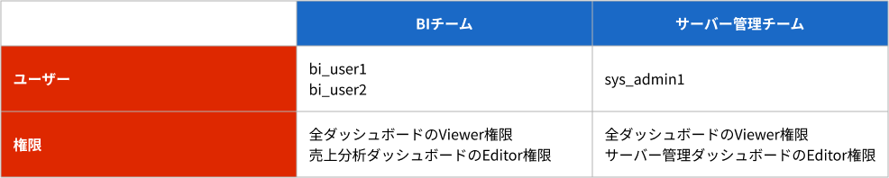
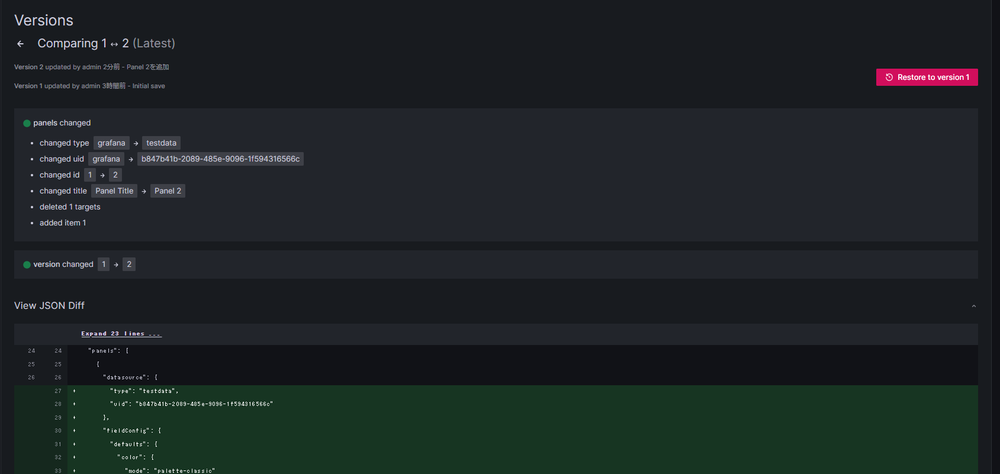

# よくわかるGrafana入門 ～ユーザー・リソース権限管理編～
## TeamsとFolderを使った権限管理のデモ
### 環境準備
**前提**
- Docker環境があること
1. [Grafana公式のdockerによるGrafanaインストール手順](https://grafana.com/grafana/download?platform=docker)を参考に、下記のコマンドを実行。
```
docker run -d --name=grafana -p 3000:3000 grafana/grafana-enterprise:10.0.3-ubuntu
```
2. 3000番ポートでGrafanaが実行されていることを確認できる。


### デモ
今回のデモでは以下のようにチームを作成し、各チームに対してダッシュボードの権限を割り当てる
- チーム名1: BIチーム
  - 各ダッシュボードへの権限
    - ダッシュボード1: (名前: 売上分析ダッシュボード) に対する権限: 編集と閲覧
    - ダッシュボード2: (名前: サーバー管理ダッシュボード) に対する権限: 閲覧のみ
  - 割当メンバー
    - ユーザー1: bi_user1
    - ユーザー2: bi_user2
- チーム名2: サーバー管理チーム
  - 各ダッシュボードへの権限
    - ダッシュボード1: (名前: 売上分析ダッシュボード) に対する権限: 閲覧のみ
    - ダッシュボード2: (名前: サーバー管理ダッシュボード) に対する権限: 編集と閲覧
  - 割当メンバー
    - ユーザー3: sys_admin1

↓ 今回作成するチーム、ユーザー、ダッシュボード権限の関係表



前提として、権限管理の設定は、OrganizationのAdmin Roleを持つユーザーでログインして操作する必要がある。
今回は、時短のため、BIチームは全て設定済であるため、ここからサーバー管理チームを例に操作を行う。

**1. ユーザー作成**
- メニューから、[Administration] → [Users] を選択
- [New User]を押下して、ユーザー作成ページへ
- 必要事項を入力し、[Create user] を押下
  ※ここで *印 はないがEmailまたはUsernameのどちらかは必須
  
- 同様に全てのユーザーを作成する

**2. Teamsの作成**
- メニューから、[Administration] → [Teams] を選択
- [New Team] を押下して、チーム作成ページへ
- チーム名(任意でチームのメールアドレス)を入力し、[Create]を押下


**3. Teamsへのユーザーの割当**
- メニューから、[Administration] → [Teams] を選択
- ユーザーを割当したいチームを選択する

- [Add member]を押下し、割当したいユーザーとチーム内での権限を選択したら、[Save]を押下してチームにユーザーを割り当てる

- 同様に、他のユーザーも割り当てる

**4. ダッシュボードの作成**
- メニューから、[Dashboards] を選択
- [New] → [New Dashboard] → [+ Add visualization] を選択
- Select data source で [--Grafana--] を選択すると、モックのデータが挿入される
- 右上の[Save]を押下して出た画面で、ダッシュボード名とフォルダを入力し、[Save]を押下
- 同様に他のダッシュボードも作成する

**5. 権限の割当**
- 権限を割り当てたいダッシュボードを選択
- 歯車マークを押下して [Dashboard settings] を開く
- [Dashboard settings] のメニューから [Permissions] を選択し、[Add a permission] を押下
- 権限を追加するチームとその権限を選択し、[Save] を押下

- 同様に、他のダッシュボードに対しても新たな権限を割り当てる

**6. 動作確認**
- BIチームに所属するユーザーでログインすると、2つのダッシュボードはどちらも閲覧できるが、売上分析ダッシュボードのみが編集可能となっている
- サーバー管理チームに所属するユーザーでログインすると、2つのダッシュボードはどちらも閲覧できるが、サーバー管理ダッシュボードのみが編集可能となっている

## ダッシュボードの変更履歴管理の紹介
Grafanaのダッシュボードでは、バージョン履歴管理をすることができます。
複数人が編集可能なダッシュボードでは、誰がいつどんな変更を加えたのかが知りたかったり、ダッシュボードを過去の状態に戻したかったりすることがあると思います。この機能がこれを解決します。
また、バージョンごとにコピーが保存されるため、ダッシュボードを以前の状態に復元することも容易です。
[公式ドキュメント - ダッシュボードのバージョン履歴を管理する](https://grafana.com/docs/grafana/latest/dashboards/build-dashboards/manage-version-history/)

### デモ
このデモでは先程作成したダッシュボードを編集し履歴を残し、状態を比較して元の状態に戻す。

**1. ダッシュボードに変更を加え保存する**
- まず、サーバー管理ダッシュボードを開き、新たに適当なパネルを作成する。
- [Save] を押下して表示された画面で変更内容を記入して [Save] を押下して保存

**2. 履歴を確認、バージョンを比較する**
- ダッシュボード画面で歯車マークを押して [Dashboard settings] に移動する
- [Dashboard settings] のメニューから [Versions] を選択し、Version管理画面を表示。誰がいつダッシュボードを編集したか、またその際のメモを確認することができる。
- 2つのVersionを選択し、[Compare versions] を選択する
- 2つのVersionの違いを確認することができる。Grafanaではダッシュボードはjsonとしても記録されているが、その違いをDiffで確認することもできる。


**3. ダッシュボードを変更前の状態に戻す**
- 変更を加える前の状態に戻すために、戻したいバージョンの右側にある [Restore] ボタンを押下する
- 確認画面が出るので、[Yes, restore to version1] を押下する

- すると、version1からコピーした新しいバージョンが最新の履歴として残っていることが確認できる。
またダッシュボードを確認しても、サーバー管理ダッシュボードに作成した新しいパネルがもとのない状態に戻っていることを確認できる。


### Links
- SIOSブログ・動画
    - [よくわかるGrafana入門【ユーザー・リソース権限管理編】](https://tech-lab.sios.jp/archives/35409)
    - [よくわかるGrafana入門【ダッシュボード編①】](https://tech-lab.sios.jp/archives/32819)
    - [よくわかるGrafana入門【ダッシュボード編②】](https://tech-lab.sios.jp/archives/32868)
    - [【動画公開】<デモ>初心者向け～Grafanaの始め方](https://column.api-ecosystem.sios.jp/visualize/grafana/175/)
    - [【動画公開】<デモ>Grafanaを使って、Kubernetesデータを可視化しよう](https://column.api-ecosystem.sios.jp/visualize/grafana/254/)
    - [Grafana Cloud メトリクス：監視すべきメトリクスとベストプラクティスへのガイド](https://column.api-ecosystem.sios.jp/visualize/grafana/321/)
    - [【デモ動画公開】Grafana～初めてのダッシュボード作成](https://tech-lab.sios.jp/archives/grafana_seminar_202306)
- お問い合わせ
    - mail :apisupport@sios.com
