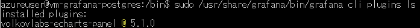
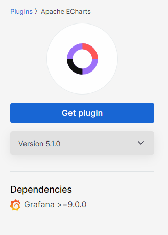

# アップグレード
今回のデモでは、バックアップリストアのデモを行った際の[こちらの手順](../backup-restore/README.md)の中で作成したUbuntu上にaptリポジトリを使ってインストールしたgrafana-enterprise v9.5.13の環境を、grafana-enterprise v10.0.0にアップグレードする。

事前準備として、バックアップリストアでバックアップしたVMと同様に環境をセットアップする。

Grafanaのアップグレードの大まかな流れは、以下の手順である。

1. **Grafanaをバックアップする**
2. **Grafanaをアップグレードする**
3. **プラグインの更新**
4. **各バージョンのアップグレードによる影響を確認**

アップグレードして不具合が生じてしまった場合に、元のバージョンに戻せるように、バックアップを行ってから、アップグレードを行う。基本的にGrafanaのアップグレードには下位互換性があり、アップグレードプロセスは単純で、ダッシュボードやグラフは変更されない。

しかし、一部のリリースでは重大な変更が行われており、これらの変更の概要は、[「新機能」](https://grafana.com/docs/grafana/latest/whatsnew/)ドキュメントに記載されているので、アップグレードしたいバージョンのドキュメントを確認し、必要に応じて対応を行う必要がある。

アップグレードもバックアップリストアと同様に、データが失われた場合の業務影響が大きいサービスでは、テスト環境または開発環境で正しく行われるかをテストすることが望ましい。

## Grafanaをバックアップする
Grafanaのバックアップは、[バックアップリストアのデモ手順](../backup-restore/README.md)を見て、同様に行う。
今回のセミナーのデモでは、バックアップは実施済みの状態にしておく。

## Grafanaをアップグレードする
ここでは、aptリポジトリからGrafanaをインストールした場合のアップグレードの手順について解説する。
他の方法でインストールしたGrafanaのアップグレード方法については、[アップグレードしたいバージョンのドキュメント](https://grafana.com/docs/grafana/latest/upgrade-guide/upgrade-v10.2/)を参照する。

0. 事前にGrafanaにアクセスし、バージョンが9.5.13であることを確認する

アクセス用URL: [http://vm-grafana-postgres-upgrade.eastus.cloudapp.azure.com:3000](http://vm-grafana-postgres-upgrade.eastus.cloudapp.azure.com:3000)

1. 以下のコマンドを実行し、Grafanaをアップグレードする

※バージョンを指定せず、最新版にアップグレードする場合、バージョンの指定は不要。
```bash
# パッケージリストの更新
sudo apt-get update
# Grafanaのアップグレード
$ sudo apt install --only-upgrade grafana-enterprise=10.0.0
```

2. 以下のURLにアクセスし、Grafanaがv10.0.0にアップグレードされたことを確認する

アクセス用URL: [http://vm-grafana-postgres-upgrade.eastus.cloudapp.azure.com:3000](http://vm-grafana-postgres-upgrade.eastus.cloudapp.azure.com:3000)


## プラグインの更新
プラグインには、Grafanaのバージョンとの対応がある。そのため、プラグインをアップグレードしたGrafanaのバージョンに更新する必要がある。
今回は、バックアックリストアのデモでインストールしたapache-echartsプラグインを更新する。
プラグインのリストや更新には、grafana cliコマンドを利用することができる。grafana cliコマンドについての説明は[こちらのドキュメント](https://grafana.com/docs/grafana/latest/cli/)を参照。

まず、grafana cliコマンドを`sudo /usr/share/grafana/bin/grafana cli plugins ls`と実行し、現在インストールされているプラグインのバージョンを確認する。



すると、今回はv5.1.0と最新版で、プラグインの公式ページによるとDependenciesにGrafana9以上、と書かれているので特にプラグインに対しての更新対応は必要ないとわかる。




今回はプラグインの更新が必要なかった。しかし、利用していたプラグインのバージョンが古く、アップグレードしたGrafanaのバージョンに対応していなかった場合は、アップグレードしたいGarfanaのバージョンに対応したバージョンのプラグインが存在するかどうかを確認し、プラグインを更新する必要がある。さらに、そこでプラグインに対応するバージョンがなかった場合は、Grafanaの更新自体を踏みとどまるか、別の代替プラグインを探す、アップグレードによるプラグインの影響を調べるなどの対応策を取る必要がある。

## 各バージョンのアップグレードによる影響を確認
Grafanaのアップグレードでは、全てのバージョンにアップグレードする際に完了する必要がある一般的なタスクに加えて、バージョンによって追加のアップグレードタスクを行う必要がある場合がある。これらは基本的には[Grafanaの新機能](https://grafana.com/docs/grafana/latest/whatsnew/)のドキュメントに書かれていて、多くの重大な変更を含むリリースの場合は、別の[重大な変更](https://grafana.com/docs/grafana/latest/breaking-changes/)ドキュメントに書かれている。

**Grafana v9.5 → v10.2 にアップグレードするときの注意点**
今回は、Grafana9の最新版であるv9.5からv10.0へアップグレードを行う際の注意点を知るため、以下の2つのドキュメントを確認した。
- [Upgrade to Grafana v10.0](https://grafana.com/docs/grafana/latest/upgrade-guide/upgrade-v10.0/#technical-notes)
  このドキュメントのTechnical notesという項目に、アップグレードに影響を与える可能性があるこのバージョンのGrafanaの変更と、その対象方法がいくつか示されている。
  - RBACの無効化オプションが削除された
  - ユーザー名とメールアドレスが大文字と小文字を区別しない仕様に変更された
  - ダッシュボードプレビューの機能が削除された
- [Breaking changes in Grafana v10.0](https://grafana.com/docs/grafana/latest/breaking-changes/breaking-changes-v10-0/)
  このドキュメントには、Grafanaをv10.0にアップグレードする際に注意する必要がある重大な変更について示されている。
  - Angularが非推奨となり、新しいGrafana Cloud スタックではデフォルトでオフになる
  - Grafanaのレガシーアラートは非推奨隣、内部または外部からの貢献を受付終了しました。
  - APIキーはサービスアカウントに以降されました
  上記のような変更について、さらに多くの項目が書かれており、それらの変更が自分の利用しているGrafanaに影響を及ぼすか確認し、必要があれば対処を行う。

ドキュメントを確認した結果、今回作成したGrafanaのバージョンをv9.5からv10.0にアップグレードする際に影響が出る部分は特になかった。そのため、特に対処は行わない。
しかし、これまでの設定や、利用していたプラグインなどによっては、v9.5 → v10.0 のアップグレードでも、問題が生じる場合があるということがわかった。


ここまでで、アップグレードのデモが完了!!
必要なチェック項目は、バージョンによって異なるが、基本的には同じ流れでアップグレードを行うことができる。