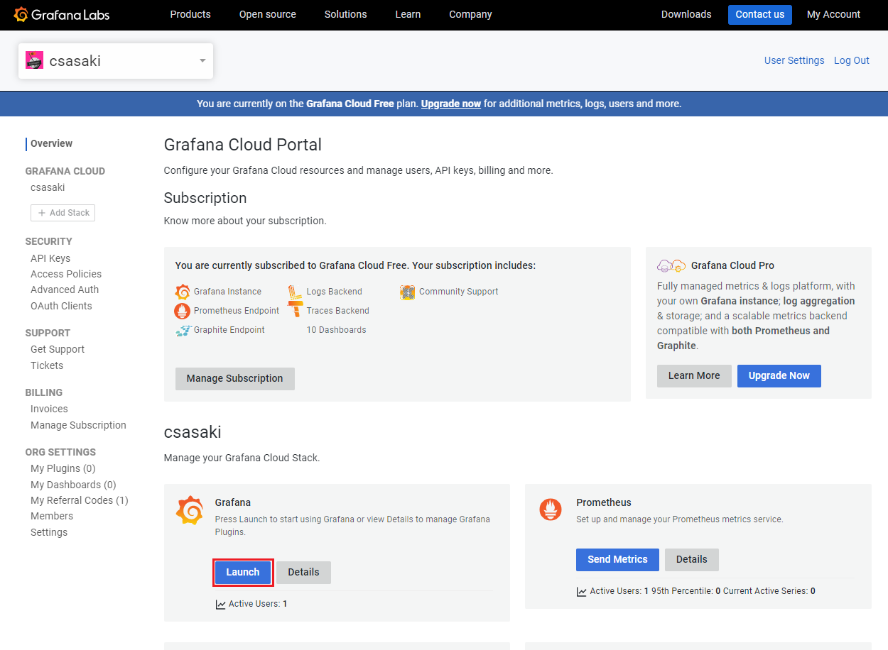

# Grafana はじめてのDashboard作成

## デモダッシュボードの作成

### 事前準備

1. Grafana Cloudのアカウントを作成する
    - Grafana Cloudのサイトで [Create free account] を押下してGrafana Cloudアカウントを作成する
        
    
        
2. Grafanaインスタンスを作成する
    - ログインしたGrafana Cloudのページから、Grafanaの[launch]ボタンを押下してGrafanaインスタンスを作成する。
    
    
    
    - インスタンスが立ち上がると、GrafanaのHomeが表示される。
    
    
    
3. 「TestData」プラグインを追加
    - 左上のハンバーガーアイコンをクリックしてメニューを表示させ、[Administration] → [Plugins] を選択してプラグイン管理画面へ移動
    
    
    
    - plugin検索フォームにtestと入力し、TestDataプラグインを選択
    
    
    
    - [Create a TestData data source]をクリック
    
    
    
    - データソース選択画面で「TestData」というデータソース名が自動で入力されているので、「TestData demo」という名前に変更し、[Save & test]を押下してデータソースを登録する。
    
    
    
    - 登録が正常に完了すると、「Data source is working」と表示される。これで事前準備が完了。    

### 作成するパネル

今回のデモでは、食品販売業者の売上情報のcsvを用いて、ダッシュボード上で4種類のパネルを作成していきます。このデモを通して、Grafanaの可視化の操作について学んでいきましょう。

- 作成するパネル
    1. 売上情報の表（表）
        
    
    
    1. 日付ごとの売上金額（棒グラフ）
        
    
        
    2. 商品別売上金額ランキング（棒グラフ）
        
    
        
    3. 商品別売上金額割合（円グラフ）
        
    
        

### パネルの編集
- 売上情報の表の作成
    - 使用するデータは以下のcsv
    ```csv
    日付,商品名,価格,売上個数,売上金額
    2023-01-01,Hamburger,500,10,5000
    2023-01-01,Fries,300,20,6000
    2023-01-01,Coke,150,50,7500
    2023-01-02,Pizza,1000,5,5000
    2023-01-02,Salad,400,15,6000
    2023-01-02,Tea,200,30,6000
    2023-01-03,Ramen,800,8,6400
    2023-01-03,Sushi,1200,3,3600
    2023-01-03,Beer,300,40,12000
    ```
    - 左メニューの[Dashboards] を選択
    - 右上の [New] → [New Dashboard] をクリック
    - 次に現れるページで [Add visualization] をクリック
    - パネル編集画面が出るので、ここで上記のデータをもとに表パネルを作成
        - データソースに先ほど選択したデータソース "TestData demo" を選択
        - Scenarioで "CSV content" を選択。すると、csvデータをデータソースとして使用することが出来るようになる
        - csvデータを張り付ける
        - "Data is missing a time field" というコメントと、"Switch to table", "Open visualization suggestions" という2つの選択肢が表示されるので、"Switch to table"を選択し、表形式にする（パネルの見た目の変更は、右側の設定のVisualizationsからでも可能）
        - [Panel options] の Titleを「売上表」にし、パネル名を変更する
        - ここまでできたら、「売上情報」のような適当な名前をつけてダッシュボードを保存しておく


- 日付ごとの売上金額グラフの作成
    - まず、Table形式で表示されているパネルの右上のアイコンをクリック → 表示されたメニューの [More] → [Duplicate] でパネルを複製する
    - 新しく作成したパネル右上をクリックしてメニューを表示し、[Edit] を選択して編集画面に遷移
    - 右側上部の[Visualizations]メニューから[Bar chart]を選択する
    - するとまず、行ごとですべての値を棒グラフにプロットしたグラフが表示される
        - Table viewをONにする
        - 表示されるグラフは、編集画面上部のTable viewをONにした際のtableの情報をもとに描画されている
    - ここから、日付でグループ化して売り上げの合計を表示するように、[Transform]でデータを整形する
        - [Add transformation] → [Group by]で、SQLと同じようにGroup byの操作ができる。日付ごとにグループ化した売上金額の合計値を利用したいので、"日付"で[Group by]を選択して、"売上金額"で[Calculate]→[Total]を選択して、日付ごとの売上金額を計算する
        - 設定後のTable viewとTransformの設定は以下の通り。
        
        
        
        - データの整形が完了したので、Table viewをOFFにして、棒グラフを表示させる。すると、日付ごとの売上情報が表示されている。
        - [Panel options] の Titleを「日付ごとの売上金額」にし、パネル名を変更する。
        - ここまでできたら、適当なコメントを入力して保存する。
        - 完成系はこちら。
        
        
        
- 商品別売上ランキング棒グラフの作成
    - 先ほどの新しいグラフを作成したときと同様に、Table形式で表示されているパネルの右上をクリック → 表示されたメニューの [More] → [Duplicate] でパネルを複製する
    - 新しく作成したパネル右上をクリックしてメニューを表示し、[Edit] を選択して編集画面に遷移
    - 右側上部の[Visualizations]メニューから[Bar chart]を選択する。
    - するとまず、行ごとですべての値を棒グラフにプロットしたグラフが表示される
    - ここから、商品名でグループ化して売り上げの合計を表示するように、[Transform]でデータを整形する
        - 編集画面下部の[Query]タブの横にある[Transform]を利用すると、データソースから読み込んだ値に対して様々な変形を加えることができる
        - 整形するデータの形式を確認するために、画面上部の[Table view] をONにする
        - [Add transformation] → [Group by]で、今回は商品ごとでGroup byし、売上金額の合計を求める。
        - [Add transformation] → [Group by]を追加、商品ごとにグループ化した売上金額の合計値を利用したいので、"商品名"で[Group by]を選択して、"売上金額"で[Calculate]→[Total]を選択して、商品ごとの売上金額を計算する
        - 売上金額が大きい順に並べるため、[Add transformation] → [Sort by] で売上金額をソートし、降順にするために[Reverse]をONにする
        - 設定後のTable viewとTransformの設定は以下の通り。
        
        
        
        - データの整形が完了したので、Table viewをOFFにして、棒グラフを表示させる。すると、商品ごとの売上情報が表示されている。
        - 右側のオプションの[Bar chart]セクションから、OrientationでHorizontalを選択して、表示を横棒グラフに変更する。
        - [Panel options] の Titleを「商品別売上金額ランキング」にし、パネル名を変更する
        - ここまでできたら、適当なコメントを残して保存する
    - 完成系はこちら
    
    
    
- 商品別売上金額割合の円グラフの作成
 上記の2グラフと同様に、自分でオプションを設定して円グラフを作成することもできるが、GrafanaのSuggetionsという機能を使用して商品別の売上金額割合を示す円グラフを作成する。
    - まず、"商品別"の売り上げ割合円グラフを作成するために先ほど作成した"商品別売上金額ランキング"の情報をもとにパネルを作成するため、 [More] → [Duplicate] でこのパネルを複製し、先ほどまでと同様に編集画面へ移動
    - 右側上部の[Bar chart]をクリックし、タブで[Visualizations]の横にある[Suggestions]を選択する。すると、現在のデータを基に、おすすめのグラフ形式が表示されるので、その中からドーナツ型の円グラフを選択する。
    - すると、商品ごとの売上の割合を示した円グラフが生成される。
    - [Panel options] の Titleを「商品別売上金額割合」にし、パネル名を変更する
    - ここまでできたら、適当なコメントを残して保存する
    - 完成系はこちら
    
    
    
- パネルの改善
    - 単位を追加
        - [Visualization]内にはパネル設定のための様々なオプションがある
        - その中の、[Standard options] → [Unit] では単位の設定ができるため、2つのパネルに"円"という単位を設定する
        
    - ダッシュボード内のパネルを並べ替えて、見やすくする。
    - 最終系はこちら
        
    
        
## おまけ
### その他のデータソース
他にも一般的によく用いられるデータソースとして、以下のようなものが挙げられます。今回は、時系列データに着目せずにダッシュボードの編集方法を中心にデモを行いましたが、Grafanaは時系列データを処理することも得意としているため、インフラ監視、アプリ監視など、時系列データに対するリアルタイム監視ツールとして多く用いられています。
- Prometheus: オープンソースのシステムおよびサービスのモニタリングおよびアラートングシステムであり、Grafanaでデータをクエリしてグラフやダッシュボードを作成し、リアルタイムのモニタリングを行うことができます。
- InfluxDB: オープンソースの高速時系列データベースであり、Grafanaで時系列データを表示し、リアルタイムのモニタリングを行うことができます。
- Elasticsearch: オープンソースの分散型検索および分析エンジンであり、ログデータやデータの検索、集約、可視化をGrafanaで行うことができます。
- MySQL: オープンソースのリレーショナルデータベース管理システムであり、GrafanaでMySQLデータベースのデータを可視化することができます。

また、プラグインは自分で作成可能であるため、技術力次第ではどんなデータソースにも対応させることができ、さらにOSSのコミュニティでも様々なデータに対応したプラグインが作成されています。

### Links
- プラグイン
    - salesforce (顧客管理・営業支援システム)
        - [salesforceプラグインの紹介](https://grafana.com/solutions/salesforce/visualize/)
    - Grafana Infinity datasource plugin
        - Grafanaを様々なデータで利用できるようにするためのコミュニティのデータソースプラグイン
        - [Grafana Infinity datasource pluginのサイト](https://sriramajeyam.com/grafana-infinity-datasource/)
    - Apache ECharts plugin
        - JavaScriptの可視化ライブラリであるApache EChartを用いた可視化を行える様にするプラグイン
        - Grafana標準で作成できない複雑なグラフもたいてい作成できる
        - [Apache ECharts plugin page](https://grafana.com/grafana/plugins/volkovlabs-echarts-panel/)
- SIOSブログ・動画
    - [よくわかるGrafana入門【ダッシュボード編①】](https://tech-lab.sios.jp/archives/32819)
    - [よくわかるGrafana入門【ダッシュボード編②】](https://tech-lab.sios.jp/archives/32868)
    - [【動画公開】<デモ>初心者向け～Grafanaの始め方](https://column.api-ecosystem.sios.jp/visualize/grafana/175/)
    - [【動画公開】<デモ>Grafanaを使って、Kubernetesデータを可視化しよう](https://column.api-ecosystem.sios.jp/visualize/grafana/254/)
    - [Grafana Cloud メトリクス：監視すべきメトリクスとベストプラクティスへのガイド](https://column.api-ecosystem.sios.jp/visualize/grafana/321/)
- お問い合わせ
    - mail :apisupport@sios.com

